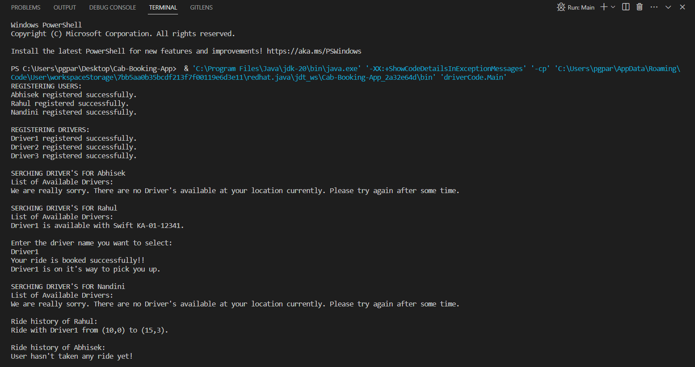
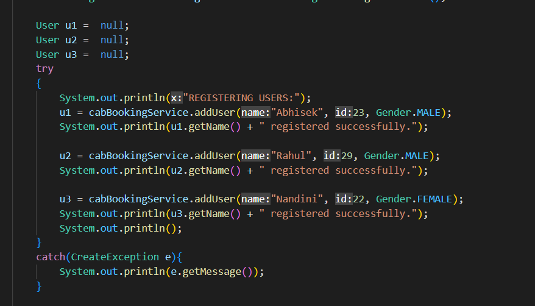
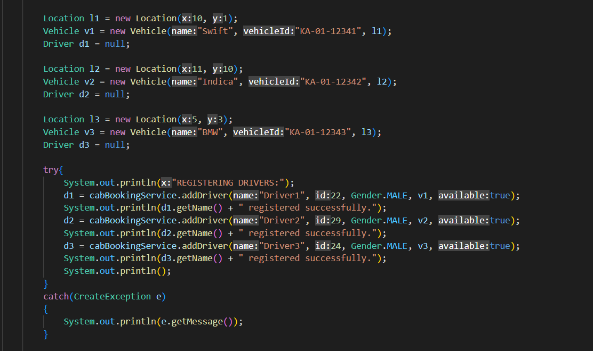
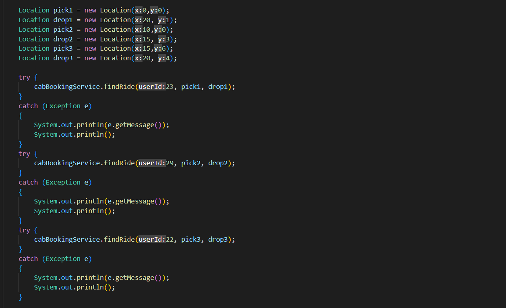
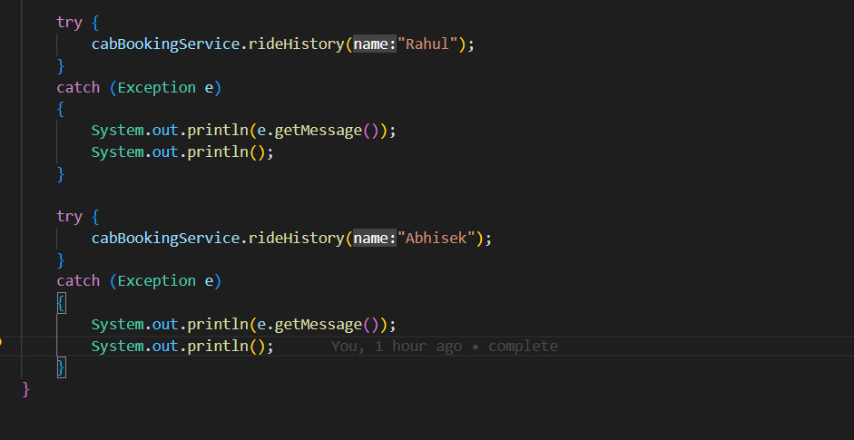
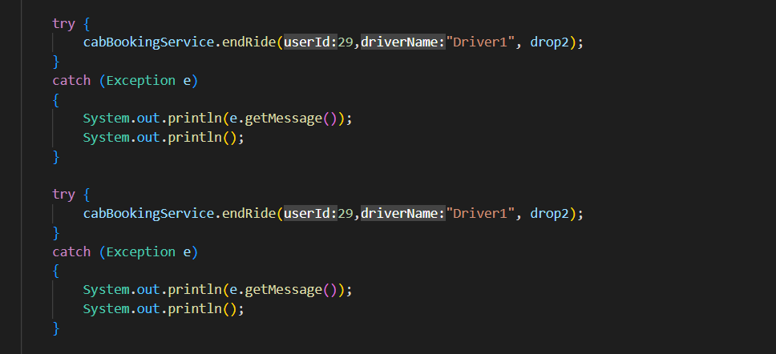

<p align="center">
  <h1 align="center">CAB BOOKING APPLICATION</h1>
  <p align="center">It's a cab booking application built using Java. We can register 'n' number of users and drivers in our application using the "addUser()" and "addDriver()" functionality. Using this application we can book a ride from a particular pickup location to a particular drop location using the "findRide()" functionality. We can check a particular user's ride history using the "rideHistory()" functionality and we can also end a previously booked ride and update the driver's location with the drop location using "endRide()" functionality. To know more, Please check out the Driver code explaination section.</p>
  
  <p align="center">
    Implementation of Cab Booking Application using JAVA.
    <br /><br />
  </p>
</p>

<h2 style="display: inline-block">Table of Contents</h2>
<ol>
  <li>
    <a href="#about-the-project">About The Project</a>
    <ul>
      <li><a href="#built-with">Built With</a></li>
    </ul>
  </li>
  <li>
    <a href="#getting-started">Getting Started</a>
    <ul>
      <li><a href="#prerequisites">Prerequisites</a></li>
      <li><a href="#installation">Installation</a></li>
    </ul>
  </li>
  <li><a href="#Driver Code Explaination">Driver Code Explaination</a></li>
  <li><a href="#contact">Contact</a></li>
</ol>

## About The Project

### Built With

- **[JAVA]**

## Getting Started

To get a local copy up and running follow these simple steps.

### Prerequisites

Install latest version of jdk

### Installation

1. Clone the project
   ```sh
   git clone https://github.com/parasgoyal2508/Cab-Booking-App.git
   ```
2. Go to project directory, go inside Driver package and run Main.java file.
   ```sh
   Run Main.java
   ```
## Driver Code Explaination

**Registering User's**



Here we are registering 3 users: u1, u2 and u3.

**Registering Driver's**



Here we are registering 3 drivers: d1, d2 and d3.

**Finding Ride**



1. Find list of availables rides depending on the location of users.
2. If no rides are available in that area then it displays message "We are really sorry. There are no Driver's available at your location currently. Please try again after some time."
3. Enter the driver's name from the available options and Enter. It will confirm the Booking.

**Checking Ride History**



1. Get the details of all the rides a particular user has taken.
2. If the user has not taken any rides then it displays a message "User hasn't taken any ride yet!"

**Ending Ride**



1. We can end the previously booked ride.
2. If ride has been already ended then it displays message "Oops, Ride is already ended!!".
3. If ride details are not found then it displays message "Oops, Ride details not found to end the ride!!".
4. Else,it ends the ride and updates the driver Location with ride's destination/drop location.

**OUTPUT**


## Contact

parasgoyalofficial@gmail.com

Project Link: [https://github.com/parasgoyal2508/Cab-Booking-App](https://github.com/parasgoyal2508/Cab-Booking-App)
