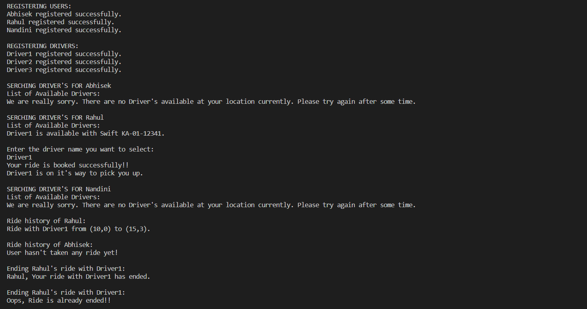

<p align="center">
  <h1 align="center">CAB BOOKING APPLICATION</h1>
  
  <p align="center">
    Implementation of Cab Booking Application using JAVA.
    <br /><br />
  </p>
</p>

<h2 style="display: inline-block">Table of Contents</h2>
<ol>
  <li>
    <a href="#about-the-project">About The Project</a>
    <ul>
      <li><a href="#built-with">Built With</a></li>
    </ul>
  </li>
  <li>
    <a href="#getting-started">Getting Started</a>
    <ul>
      <li><a href="#prerequisites">Prerequisites</a></li>
      <li><a href="#installation">Installation</a></li>
    </ul>
  </li>
  <li><a href="#Driver Code">Driver Code Explaination</a></li>
  <li><a href="#contact">Contact</a></li>
</ol>

## About The Project

### Built With

- **[JAVA]**

## Getting Started

To get a local copy up and running follow these simple steps.

### Prerequisites

Install latest version oh jdk

### Installation

1. Clone the project
   ```sh
   git clone https://github.com/parasgoyal2508/Cab-Booking-App.git
   ```
2. Go to project directory, go inside Driver package and 
   ```sh
   Run Main.java
   ```
## Driver Code

**Registering User's**


Register 'n' number of user's.

**Registering Driver's**


Register 'm' number of driver's.

**Finding Ride**


1. Find list of availables rides depending on the location of users.
2. Enter the driver's name from the available options and Enter.
3. If no rides are available in that area then it displays message "We are really sorry. There are no Driver's available at your location currently. Please try again after some time."

**Checking Ride History**


1. Get the details of all the rides a particular user has taken.
2. If the user has not taken any rides then it displays a message "User hasn't taken any ride yet!"

## Contact

parasgoyalofficial@gmail.com

Project Link: [https://github.com/parasgoyal2508/Cab-Booking-App](https://github.com/parasgoyal2508/Cab-Booking-App)